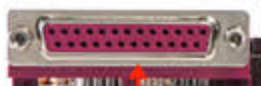

# Tarea.md
 

 

El puerto PS/2 es un conector mini-DIN de 6 pines utilizado para conectar algunos teclados y mouses a un sistema informático compatible con PC.

 

es una interfaz entre un computador y un periférico, cuya principal característica es que los bits de datos viajan juntos, enviando un paquete de byte a la vez. 
